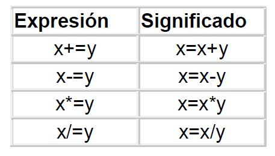
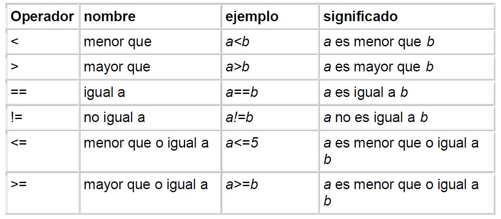
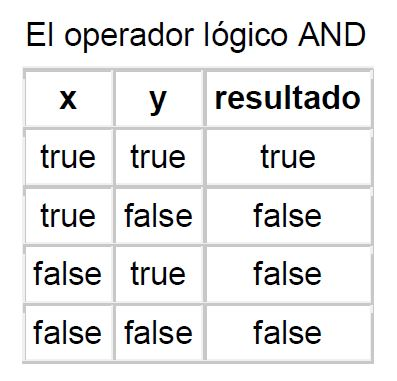
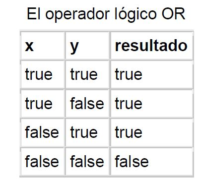
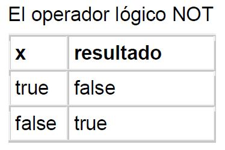
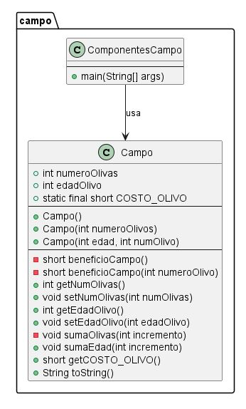

## Una introducción al uso del lenguaje JAVA

### Bibliografía de consulta: INTRODUCCION A LA PROGRAMACION ORIENTADA A OBJETOS

### Desarrollado por: SUN Microsystem.

### Autor: Francisco Mesa.

---

**_Recursos_**

- Para descargar al IDE de desarrollo para programar y trabajar con el lenguaje JAVA.
  https://www.eclipse.org

- Para descargar al compilador y lenguaje JAVA.
  https://www.oracle.com/ar/java/

---

## Es importaante saber ciertos conceptos, cuando se hace referencia en el lenguaje sobre que es una Sentencia, un bloque de codigo, una expresión, etc.

Se definen a continuación estos conceptos

### SENTENCIAS:

    	 Una sentencia es una orden que se le da al programa para realizar una tarea
    	 espec'ifica, estas pueden ser:
    	  int i = 1; declarar una variable e inicializarla.
    	  import java.awt.*; importar una clase
    	  System.out.println("Mostrar una linea"); Mostrar un mensaje en pantalla.
    	  rect.mover(10, 20); llamar a una función.

    	 Las sentencias terminan con ; este carárter separa una sentencia de la siguiente.
    	 		//imprime un mensaje con salto de línea.

### BLOQUES DE CODIGO:

    	 Un bloque de código es un grupo de sentencias que se comportan como una
    	 unidad. Un bloque de código está limitado por las llaves de apertura { y cierr }.

### EXPRESIONES:

    	 Una expresión es todo aquello que se puede poner a la derecha del operador
    	  asignación = Por ejemplo:
    	  x = 123;
    	  y = (x+100)/4;
    	  area circulo.calcularArea(2.5);
    	  Rectangulo r = new Rectangulo(10, 10, 200, 300);

    	 La primera expresión asigna un valor a la variable x.
    	 La segunda, realiza una operación.
    	 La tercer, es una llamada a una función miembro calcularArea desde un objeto circulo de una clase determinada.
    	 La cuarta, reserva espacio en memoria para un objeto de la clase Rectangulo
    	 mediante la llamada a una función especial denominada constructor.

### VARIABLES:

    	 Una variable es un nombre que se asocia a una porción de la memoria del
    	 ordenador, en la que se guarda el valor asignado a dicha variable.
    	 Todas las variables han de declararse antes de usarlas, la declaración consiste en una sentencia en la que figura el tipo de dato y el nombre que asignamos a la variable. Una vez declarad se le podrá asignar valores.
    	 Java tiene tres tipos de variables:
    	  	de instancia.
    	  	de clase.
    	  	locales.

    	 Las variables de instancia o miembros de datos: Se la usan para guardar los atributos de un objeto particular.
    	 Las variables de clase o miembros datos estáticos: Son similares a las variables de instancia, con excepción de los valores que guardan son los mismos para todos los objetos de una determinada clase.
     En el siguiente ejemplo, PI guarda el mismo valor para todos los objetos de la clase Circulo, pero el radio de cada circulo(objeto) puede ser diferente.

    	 class Circulo{
    	   	static final double PI = 3.141516;
    	   	double radio;
    	   }

    	 Las variables locales: se itulizan dentro de las funciones miembro o métodos.
    	 En el siguiente ejemplo area es una variable local a la función calcularArea en la que se guarda el valor del área de un objeto de la clase Circulo.

    	 class Circulo{
    	  	double calcularArea(){
    	  		double area = PI * radio * radio;
    	  		return area;
    	  }

    	 Las variables locales se declaran en el momento en el que son necesarias.
    	 También se pueden inicializar en el momento en el que son declaradas.

    	   int x = 0;
    	   String nombre = "Angel";
    	   double a = 3.5, b = 0.0, c = *2.4;
    	   boolean bNuevo = true;
    	   int [] datos;

      Delante del nombre de cada variable se ha de especificar el tipo de variable
      que hemos destacado en la letra negrita.

### VARIABLES BOOLEANAS

      Una variable booleana solamente puede guardar uno de los dos posibles valores:
      true (verdadero) y false (falso).

      boolean encontrado = false;
      {...}
      encontrado =  true;

### VARIABLES ENTERAS

Una variable entera consiste en cualquier cifra precedida por el signo más
(opcional), para los positivos, o el signo menos, para los negativos.
Son ejemplos de números enteros:
12, -36, 0, 4687, -3560
Como ejemplos de declaración de variables enteras tenemos:
int numero = 1025;
int x, y; // declaracion de dos variables.
long m = 30L;
En la tercera linea 30, es un número de tipo int por defecto, le ponemos el subfijo L en mayúscula o minúscula para indicar que es de tipo long.
Existen como vemos en la taba varios tipos de números enteros (byte, short, int, long).

### VARIABLES CON COMA FLOTANTE

    	 Las variables del tipo float o double (como flotante) se usan para guardar
    	 números en memoría que tienen parte entera y parte decimal.
    	  	double PI = 3.141516;
    	  	double G = 9.7805;

### VALORES CONSTANTES

    	Cuando se declara una variable del tipo final, se ha de inicializar y cualquier intento de modificarla en el curso de la ejecución del programa da lugar a un error.
    	Normalmente, las constantes de un programa se suelen poner en letras mayúsculas para distinguirlas de las que no son constantes. He aquí ejemplos de declaración de constantes.
    	   	final double PI = 3.141516;
    	   	final int MAX_DATOS = 150;

### LAS CADENAS DE CARACTERES O STRINGS

    	Las cadens de caracteres o strings en Java son los objetos String
    	  	String mensaje = "El primer programa";

### PALABRAS RESERVADAS AL LENGUAJE

En el siguiente cuadro se listan las palabras reservadas, aquellas que emplea el lenguaje Java, y que el programador no puede utilizar como identificadores (nombre de una variable).

- Tipos de datos: **_boolean_**, **_float_**, **_double_**, **_int_**, **_char_**
- Sentencias condicionales: **_if_**, **_else_**, **_switch_**
- Sentencias iterativas: **_for_**, **_do_**, **_while_**, **_continue_**, **_break_**
- Tratamiento de las excepciones: **_try_**, **_catch_**, **_finally_**, **_throw_**
- Estructura de datos: **_class_**, **_interface_**, **_implements_**, **_extends_**
- Modificadores y control de acceso: **_public_**, **_private_**, **_protected_**, **_transient_**
- Otras: **_super_**, **_null_**, **_this_**

---

## OPERADORES

Todos los lenguajes de programacion permiten realizar operaciones entre los tipos de datos básicos: suma, resta, producto, división, etc.

### Los operadores aritméticos

Java tiene cinco operadores aritméticos cuyo significado se muestra a continuación.

- Operador: + -> Nombre: Suma -> Ejemplo: 3 + 4
- Operador: - -> Nombre: Resta -> Ejemplo: 3 - 4
- Operador: * -> Nombre: Producto -> Ejemplo: 3 * 4
- Operador: / -> Nombre: División -> Ejemplo: 100 / 5
- Operador: % -> Nombre: Módulo -> Ejemplo: 100 % 5

El cociente entre dos enteros da como resultado un entero. Por ejemplo al dividir 100 entre 50 nos da como resultado 2.

El operador módulo da como resultado el resto de la división entera. Por ejemplo 100 % 5 da como resultado 0, que es el resto de la división entre 100 y 50.

### El operador asignación

Nos habremos dado cuenta que el operador más importante y más frecuentemente usado es el operador asignación ¡, que hemos empleado para la inicialización de las variables. Así,
int numero;
numero = 20;
La primera sentencia declara una variable entera de tipo int y le da un nombre (numero), la segunda sentencia usa el operador asignación para inicializar la variable con el número 20.
Consideremos ahora la siguiente sentencia
a = b;
que asigna a a el valor de b. A la izquierda siempre tendremos una variable tal como a, que recibe valores, a la derecha otra variable b, o expresión que tiene un valor.

Por tanto, tienen sentido las expresiones
a = 1234;
double area = calculaArea(radio);
superficie = ancho \* alto;

Sin embargo, no tiene sentido las expresiones

    1234 = a;
    calculaArea(radio) = area;

Las asignaciones múltiples son también posibles. Por ejemplo, es válida la sentencia
c = a = b = 400; // asigna 400 a a, b y c.

El operador asignacion se puede combinar con los operadores aritméticos

Así la sentencia
x = x + 23; equivale a x += 23;

#### Los operadores relacionales
Los operadores relacionales son símbolos que se usan para comparar dos valores. Si el resultado de la comparación es correcto la expresión considerada es verdadera, en caso contrario es falsa.

Se debe tener especial cuidado en no confudir el operador asignación con el operador relacional igual a. Las asignaciones se realizan con el símbolo =, las comparaciones con ==.
En el programa se compara la variable i que guarda un 8, con un conjunto de valores, el resultado de la comparaci'on es verdadero (true) o falso (false).

#### Los operadores lógicos
Los operadores lógicos son:
- && AND (el resultado es verdadero si ambas expresiones son verdaderas).
- || OR (el resultado es verdadero si alguna expresión es verdadera).
- !NOT (el resultado invierte la condición de la expresión).

AND y OR trabajan con dos operandos y retornan un valor lógico basadas en las denominadas tablas de verdad. El operador NOT actúa sobre un operando. Estas tablas de verdad son conocidas y usada en el contexto de la vida diaria, por ejemplo:"si hace sol Y tengo tiempo, iré a la playa", " si NO hace sol, me quedaré en casa", "si llueve O hace viento,iré al cine". Las tablas de verdad de los operadores AND, OR y NOT se muestran en las tablas siguientes

### Clases
@startuml
package campo {

    class Campo {
        + int numeroOlivas
        + int edadOlivo
        + static final short COSTO_OLIVO
        --
        + Campo()
        + Campo(int numeroOlivos)
        + Campo(int edad, int numOlivo)
        --
        - short beneficioCampo()
        - short beneficioCampo(int numeroOlivo)
        + int getNumOlivas()
        + void setNumOlivas(int numOlivas)
        + int getEdadOlivo()
        + void setEdadOlivo(int edadOlivo)
        - void sumaOlivas(int incremento)
        + void sumaEdad(int incremento)
        + short getCOSTO_OLIVO()
        + String toString()
    }

    class ComponentesCampo {
        --
        + main(String[] args)
    }

    ComponentesCampo --> Campo : usa
}
@enduml

